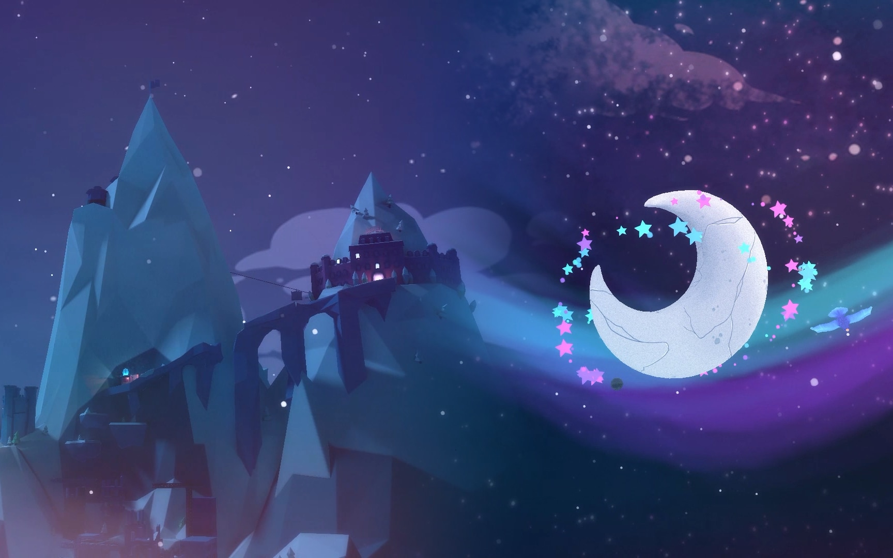
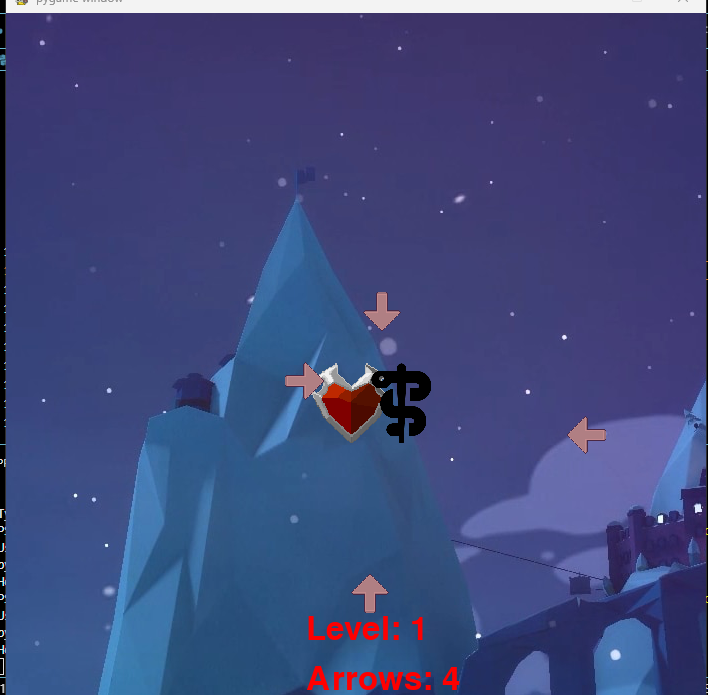

:warning: Everything between << >> needs to be replaced (remove << >> after replacing)

# Ramen
## CS110 Final Project  Spring, 2024 

## Team Members

Tasnimul Fahim, Andy Huang

***

## Project Description

<<<<<<< HEAD
You are a hero who is getting attacked by arrows. However, you have your trusty staff and your slithering companion to defend you from these arrows. The question is how long can you last?
=======

>>>>>>> a99a223fea2090a672620890ad9c4315da73667a

***    

## GUI Design

### Initial Design

### Final Design

## Program Design

### Features

1. Level Counter
2. Moveable Sprite
3. Collisions
4. Music
5. Arrow Counter

### Classes

- << You should have a list of each of your classes with a description >>
airbend.py class is the class that holds the shield
arrow.py class is the class that holds all the enemy arrows
hero.py is the class that holds the heart sprite
music.py holds the music files
## ATP
Test 1: Games opens up 
| Step                 |Procedure             |Expected Results                   |
|----------------------|:--------------------:|----------------------------------:|
|  1                   | Click Run            |Game Autostarts as it should       |
|  2                   | Game Starts          |                                   |

Test 2: Verify shield moves in the direction of the arrow keys 
| Step                 |Procedure             |Expected Results                   |
|----------------------|:--------------------:|----------------------------------:|
|  1                   | Start game           |      Player moves in the          |
|  2                   | Press Left arrow key |      direction in respect to      |
|  3                   |Verify shield moves Left|    the directional arrow        |
|  4                   | Press Up arrow key   |      key pressed.                 |
|  5                   |Verify shield moves Up|                                   |
|  6                   | Press Right arrow key|                                   |
|  7                   |Verify shield moves Right|                                |
|  8                   | Press Down arrow key |                                   |
|  9                   |Verify shield moves Down|                                 |

Test 3: Collision; Arrow hits shield 
| Step                 |Procedure             |Expected Results                  |
|----------------------|:--------------------:|--------------------------------- |
|  1         |Game starts                        |    Arrow Sprite should        |                        
|  2         |Arrow moves towards hero           |  disappear. "Hero" should     |                        
|  3         |Verify arrow collides with shield  | be alive and game continues   |
                        

Test 4: Next Level Counter
| Step  |Procedure                                         |Expected Results      |
|-------|:------------------------------------------------:|----------------------|
|  1    | Level icon pops up on screen                     | Level number will    |
|  2    |After waves of arrows, increase level counter by 1| visibly change. More |
|  3    |Verify amount of arrows increase                  | arrows will appear.  |

Test 5: Music runs
| Step                 |Procedure             |Expected Results                   |
|----------------------|:--------------------:|----------------------------------:|
|  1                   | Game Starts          |  Music should be playing,         |
|  2                   | Music Plays          |  once game starts.                |

Test 6: Arrow Counter
| Step                 |Procedure                  |Expected Results                   |
|----------------------|:-------------------------:|----------------------------------:|
|  1                   | Game Starts               |      "Arrow Counter Changes"      |
|  2                   | Block Arrow      |        |
|  3                   | Verify change in Arrow    |                                   |
|  4                   | Counter                   |                                   |

Glitches: 1.Arrow count increases after blocking inital arrows with any event
          2.Arrow spawns runs into issues, does not go pass level 2 (crashes)
          3. Heart collision not working
